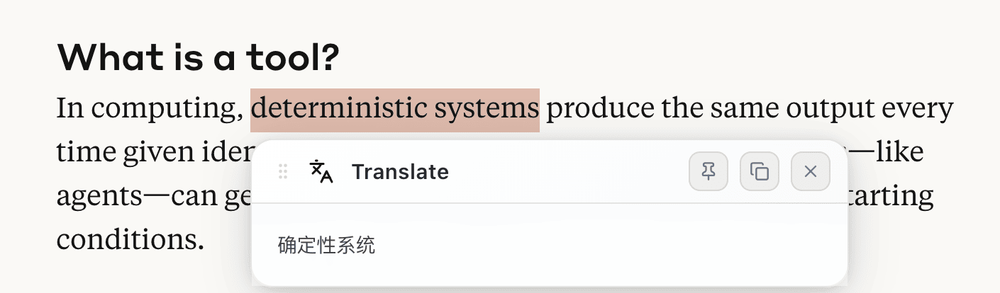
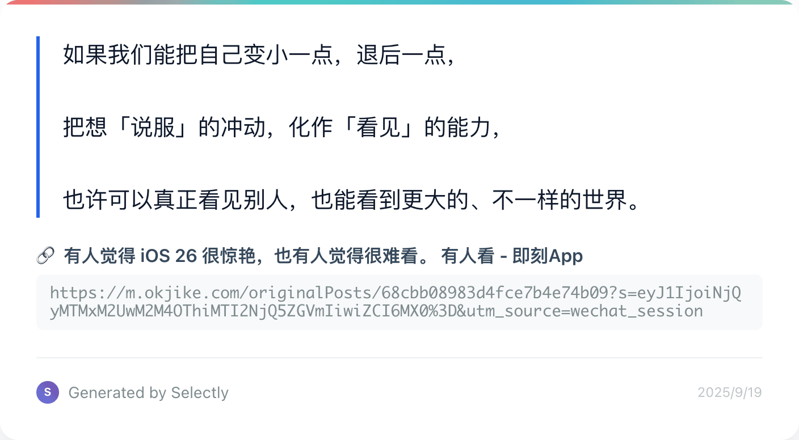

# 为什么我要开发另一款网页划词插件-Selectly

## 缘起

网页划词的需求长期存在，市面上也有不少相关的插件，那么为什么我还要重复造轮子、开发另一款呢？

回到事情的开始，我其实只想要一个划词翻译插件。市面上虽然已经有不少类似插件，我也用过一些，但总觉得不够好用。这些插件如果使用传统的翻译接口如谷歌翻译，效果肯定不好。而如果使用大语言模型，要么不够灵活，要么太贵。回到我自己的需求，我只是想要在浏览英文网站遇到不懂的单词或句子时，能够通过划词告诉我含义，简洁、精准、不啰嗦，即可。这其实只需要一次 LLM 调用 + 提示词就能解决，既然没有现成的，咱就 vibe coding 造一个吧。

## 过程

翻译的需求很快解决了，但我发现基于划词 + LLM 还可以实现更多需求，比如解释、润色、纠错等等。既然做出来了一个，那么为什么不趁机多做几个，甚至支持自定义添加呢？这就是我为什么要开发一款新的网页划词插件--Selectly 的由来了。

Selectly 致力于成为一款基于网页划词 + 人工智能，支持定制和扩展的，全家桶式工具集。我认为在大语言模型已经逐渐融入个人生活的今天，网页端的划词需求还远远没有被满足。那么 Selectly 支持哪些划词操作呢，下面我来详细介绍。

在基于 LLM 调用的功能中，除了翻译，还内置了润色、解释、纠错功能，这些功能其实只是图标和提示词的差别而已。除此之外更重要的是，Selectly 支持添加自定义的功能模块，用户只需要选择模型、输入提示词，就可以构建任意自己想要的功能。

除了基于 LLM 调用的功能，划词后还存在一些长久以来的基础需求，比如搜索、收藏、分享等。这些功能要么只能通过单独的插件来满足，要么就是体验不尽人意。既然要做基于划词的全家桶工具集，Selectly 也针对这些功能做了重点打磨。比如收藏，提供了一个内容中心页，可以方便查看基于网页分组的收藏列表。

比如分享，选择内容，点击分享后，可以生成一张附带网页标题和地址的分享图片，可以直接复制或下载。

工具多了之后，如果每次划词都全部显示的话，显然不够优雅。所以，Selectly 支持针对功能进行开关、排序、收起，可以完全根据个人的喜好来定制。

Selectly 是免费的吗？不完全是。Selectly 的基础功能是免费的，包括翻译、解释、润色、复制、搜索、跳转、分享、收藏等。但是对话和自定义功能是需要开通会员才可以使用。同时需要说明的是，Selectly 本身不提供语言模型，而需要用户配置了对应模型提供商的密钥后才可以使用，目前支持 OpenAI、Anthoripic、OpenRouter、SiliconFlow、Azure OpenAI、Ollama，以及任意兼容 OpenAI 接口标准的自定义供应商。

为什么不直接提供模型服务，因为目前提供这类服务的供应商已经非常成熟，Selectly 也不想成为赚差价的中间商。以 OpenRouter 为例，上面提供了数百种不同的模型，用户完全可以根据自己的需求来选择不同的模型，这些模型均采用按量付费的模式。针对翻译、润色这类需求，使用基础的 mini 类模型如 gpt-4o-mini，即便宜又快，效果也足够好，对用户来说非常友好。

## 展望

Selectly 未来会做什么？理论上，只要是和网页划词相关的都可能去做，当然前提是用户真的需要。Selectly 的代码基本是由 Claude Sonnet 4 和 GPT-5 完成的，大概使用了 Github Copilot 150 次的 premium requests。

最后，欢迎大家使用、反馈，可以访问 https://selectly.app 查看具体介绍。